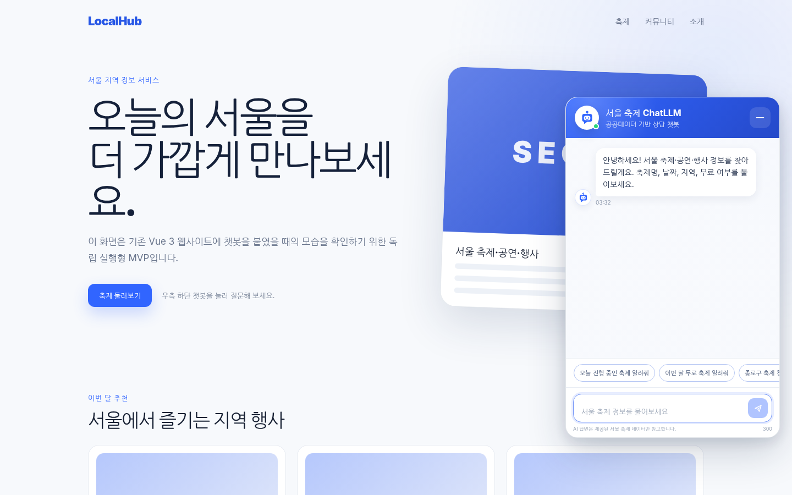

# 서울 축제 ChatLLM MVP

Vue 3 웹사이트 우측 하단에 붙일 수 있는 **상담형 플로팅 챗봇 MVP**입니다.

- 화면 오른쪽 아래의 챗봇 아이콘을 누르면 대화창이 열립니다.
- Netlify Function이 서울 축제·공연·행사 JSON 201건을 먼저 검색합니다.
- 관련 결과를 최대 5건으로 줄인 뒤에만 OpenAI Responses API를 호출합니다.
- API 키가 없거나 LLM 호출이 실패해도 검증된 JSON 검색 답변으로 동작합니다.
- Vue 프론트엔드에는 OpenAI API 키가 포함되지 않습니다.



## 1. 현재 MVP 범위

### 구현됨

- 우측 하단 원형 챗봇 아이콘
- 아이콘 클릭 시 우측 하단 상담형 대화창 표시
- 모바일에서 전체 화면 대화창 표시
- 질문·답변 말풍선, 시간, 로딩 애니메이션
- 빠른 질문 버튼
- 서울 축제명·자치구·날짜·무료 여부 검색
- 행사 기간·장소·시간·요금·좌표 근거 카드
- Netlify Function `/api/chat`
- 질문 최대 300자, 검색 결과 최대 5건
- IP 기준 분당 10회 Rate Limit 설정
- OpenAI API 장애 시 검색 기반 안전 응답
- API 키가 없는 상태에서도 로컬 UI·검색 테스트
- TypeScript 검사, 단위 테스트, 프로덕션 빌드

### MVP에서 제외됨

- 대화 영구 저장
- 회원가입·로그인
- 벡터 데이터베이스
- 스트리밍 답변
- 지도·경로·날씨
- 실시간 TourAPI 갱신
- 여러 데이터 유형을 한 번에 검색하는 통합 RAG

## 2. 실행 구조

```text
Vue 3 FestivalChatWidget
        │ POST /api/chat
        ▼
Netlify Function
        │
        ├─ 서울 축제 JSON 검색
        ├─ 관련 결과 최대 5건 선택
        ├─ API 키 없음/오류 → 검색 답변
        └─ API 키 있음 → OpenAI Responses API
```

JSON 전체를 매 질문마다 LLM에 보내지 않습니다. 검색 단계와 답변 생성 단계를 분리해 비용, 속도, 정확성을 관리합니다.

## 3. 가장 빠른 로컬 실행

### 준비물

- Node.js 22 권장(최소 20.19)
- VSCode 또는 다른 코드 편집기

### 실행

```bash
npm install
npm run dev
```

브라우저에서 아래 주소를 엽니다.

```text
http://localhost:5173
```

API 키가 없어도 검색 전용 모드로 작동합니다. 우측 하단 챗봇 아이콘을 누르고 다음 질문을 시험합니다.

```text
문학주간 2026 일정 알려줘
오늘 진행 중인 축제 알려줘
9월 종로구 무료 축제 알려줘
```

열린 챗봇 화면을 바로 확인하려면 다음 주소를 사용할 수 있습니다.

```text
http://localhost:5173/?chat=open
```

## 4. OpenAI API 연결

루트의 `.env.example`을 복사해 `.env`를 만듭니다.

Windows PowerShell:

```powershell
Copy-Item .env.example .env
```

macOS/Linux:

```bash
cp .env.example .env
```

`.env`에 실제 키를 입력합니다.

```env
OPENAI_API_KEY=발급받은_실제_키
OPENAI_MODEL=gpt-5.6-luna
CHATBOT_FORCE_FALLBACK=false
```

중요:

- `VITE_OPENAI_API_KEY`를 만들지 않습니다.
- 실제 키를 GitHub, README, 코드, 채팅에 올리지 않습니다.
- `.env`는 `.gitignore`에 포함되어 있습니다.
- 모델 ID는 계정에서 사용 가능한 다른 모델로 바꿀 수 있습니다.

환경변수를 바꾼 뒤 개발 서버를 종료하고 다시 실행합니다.

```bash
npm run dev
```

## 5. 자동 검증

```bash
npm test
npm run typecheck
npm run build
npm run bundle:functions
```

또는 한 번에 실행합니다.

```bash
npm run check
```

현재 `npm run verify` 기준 11개 테스트, Vue 빌드, Function 번들을 통과했고 `npm audit` 취약점은 0건입니다. 자세한 결과는 [검증 보고서](docs/VERIFICATION_REPORT.md)를 확인합니다.

테스트 대상:

- 정확한 축제명 검색
- 오늘 진행 중인 행사 검색
- 자치구 + 무료 조건
- 특정 월 일정 겹침
- 없는 검색어 처리
- 유아만 무료인 유료 행사의 오분류 방지
- Function의 메서드·입력 검증
- API 키 없는 검색 답변

## 6. Netlify 배포

### Netlify에 등록할 환경변수

```text
OPENAI_API_KEY = 실제 OpenAI API 키
OPENAI_MODEL = gpt-5.6-luna
CHATBOT_FORCE_FALLBACK = false
```

### 빌드 설정

`netlify.toml`에 이미 포함되어 있습니다.

```toml
[build]
  command = "npm run build"
  publish = "dist"
  functions = "netlify/functions"
```

Netlify에서는 `netlify/functions/chat.mts`가 `/api/chat` 경로로 배포됩니다.

## 7. 기존 Vue 3 사이트에 합치기

가장 간단한 동일 저장소 통합 방식입니다.

### 복사할 파일

```text
src/chatbot/
shared/chat-contract.ts
netlify/functions/chat.mts
netlify/functions/_shared/
netlify/functions/data/seoul-festivals.json
```

### 설치할 패키지

```bash
npm install openai @netlify/functions
```

### 공통 레이아웃 또는 App.vue에 추가

```vue
<script setup lang="ts">
import { FestivalChatWidget } from '@/chatbot'
</script>

<template>
  <RouterView />

  <FestivalChatWidget
    title="서울 축제 ChatLLM"
    subtitle="공공데이터 기반 상담 챗봇"
    api-endpoint="/api/chat"
    primary-color="#3165ff"
    :z-index="1200"
  />
</template>
```

이 위젯은 Vue Router, Pinia, 전역 상태, 외부 CSS 프레임워크에 의존하지 않습니다. `Teleport`로 `body` 아래에 렌더링되고 스타일은 `scoped`이므로 기존 레이아웃에 의해 잘릴 가능성을 줄였습니다.

자세한 충돌 점검은 [기존 사이트 통합 가이드](docs/INTEGRATION_GUIDE.md)를 확인합니다.

## 8. 주요 폴더

```text
src/chatbot/                         독립형 챗봇 UI 모듈
shared/chat-contract.ts              프론트·Function 공용 요청/응답 타입
netlify/functions/chat.mts           HTTP 검증 + OpenAI 호출
netlify/functions/_shared/            데이터 검색·안전 답변 모듈
netlify/functions/data/               원본 서울 축제 JSON
vite-plugins/local-netlify-function.ts 로컬 개발용 Function 어댑터
tests/                                검색·Function 테스트
docs/                                 설정·통합·아키텍처 문서
```

## 9. 데이터 출처와 라이선스

이 프로젝트는 한국관광공사 TourAPI 4.0의 서울 축제·공연·행사 데이터를 사용합니다.

- 제공 기관: 한국관광공사
- 데이터: 국문 관광정보 서비스, 서울 축제공연행사 201건
- 라이선스: 공공누리 제3유형
- 조건: 출처 표시, 원본 데이터 변경 금지
- 원본 안내: `https://www.data.go.kr/data/15101578/openapi.do`

원본 JSON의 값은 수정하지 않고 파일명만 프로젝트 친화적으로 변경했습니다.

## 10. 현재 한계

- 검색은 정형 필드와 키워드·조건 기반이며 벡터 검색이 아닙니다.
- 후속 질문 문맥을 서버에 전달하지 않습니다.
- JSON 수집 시점 이후의 변경 사항은 자동 반영되지 않습니다.
- 기존 실제 사이트 소스가 제공되지 않았으므로 구조적 통합 검토까지 완료했으며, 실제 CSS·경로 충돌은 합칠 대상 저장소에서 최종 확인해야 합니다.

## 11. GitHub에 올리기

자세한 화면·명령 절차는 [GitHub 업로드 가이드](docs/GITHUB_UPLOAD.md)를 확인합니다.


새 빈 저장소 이름을 `seoul-festival-chatbot-mvp`로 만든 다음 프로젝트 루트에서 실행합니다.

```bash
git init
git branch -M main
git add .
git commit -m "feat: add Seoul festival ChatLLM MVP"
git remote add origin https://github.com/lmg3111977/seoul-festival-chatbot-mvp.git
git push -u origin main
```

실제 `.env`가 커밋되지 않았는지 반드시 확인합니다.

```bash
git status
git ls-files .env
```

두 번째 명령이 아무것도 출력하지 않아야 정상입니다.
